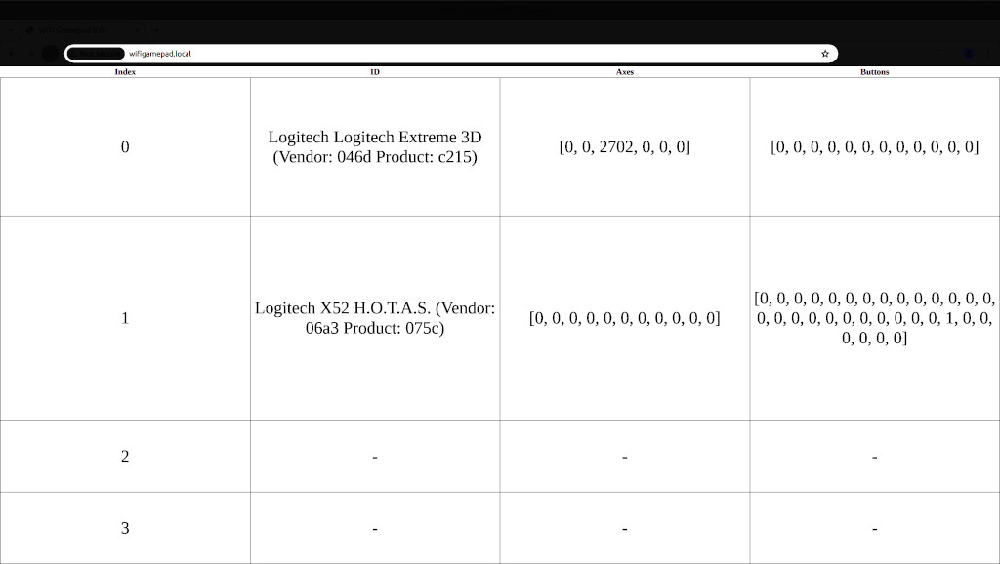
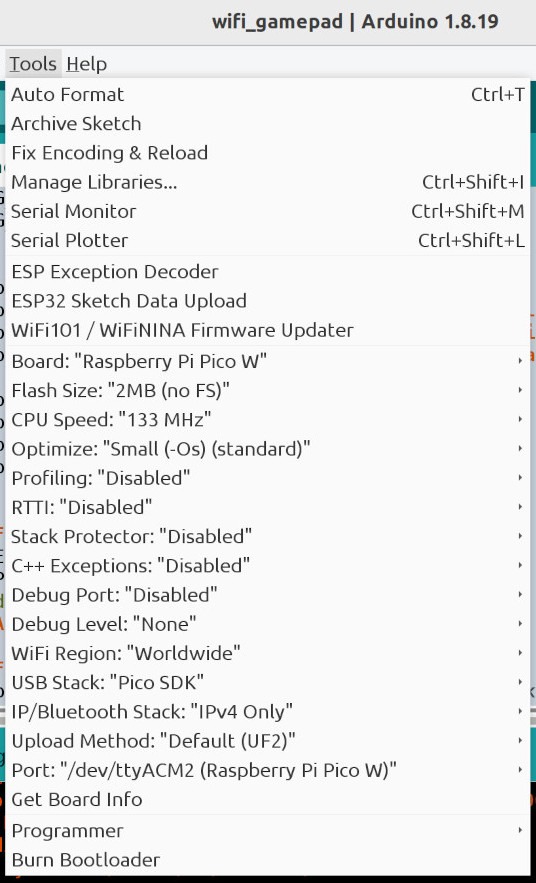

# WiFi Gamepad

Use commercial off-the-shelf joysticks and gamepads to control your WiFi board.
This project supports ESP32, Pi Pico W, and Pi Pico 2 W WiFi boards.

<kbd></kbd>

The browser screen shot shows two joysticks plugged in via USB to the computer
running Chrome/Chromium. The first joystick is a Logitech Extreme 3D. The
second is a Logitech X52.

When the sticks are moved, the axis and button values update. The same values
are sent through a web socket to the WiFi microcontroller board. The WiFi board
can use the values to control motors, servos, LEDs, etc.



## Hardware

Any one of the following.

* ESP32 with WiFi
* Pi Pico W
* Pi Pico W 2 (untested)

## Software

Arduino IDE 1.8.19 with the Arduino-Pico board package by Earle F. Philhower,
III. This project should work with the Arduino IDE 2.x.

[Installation instructions for the Arduino IDE](https://www.arduino.cc/en/software)

[Installation instructions for Arduino-Pico](https://arduino-pico.readthedocs.io/en/latest/install.html)

Once the Board option is set, the other options are left at default values.



## Libraries

Both libraries are installed using the IDE Library Manager.

* "ArduinoJson" by Benoit Blanchon
* "WebSockets" by Markus Sattler

## secrets.h is missing

secrets.h is not included because it must contain the SSID and passphrase for your
WiFi network. Or you can modify the INO file to remove `#include "secrets.h`
then add your SSID and passphrase to the INO file. Be sure not to publish your
secrets to the world.

secrets.h should include something like the following.

```c
#define STASSID "myssid"
#define STAPSK "mypassphrase"
```
